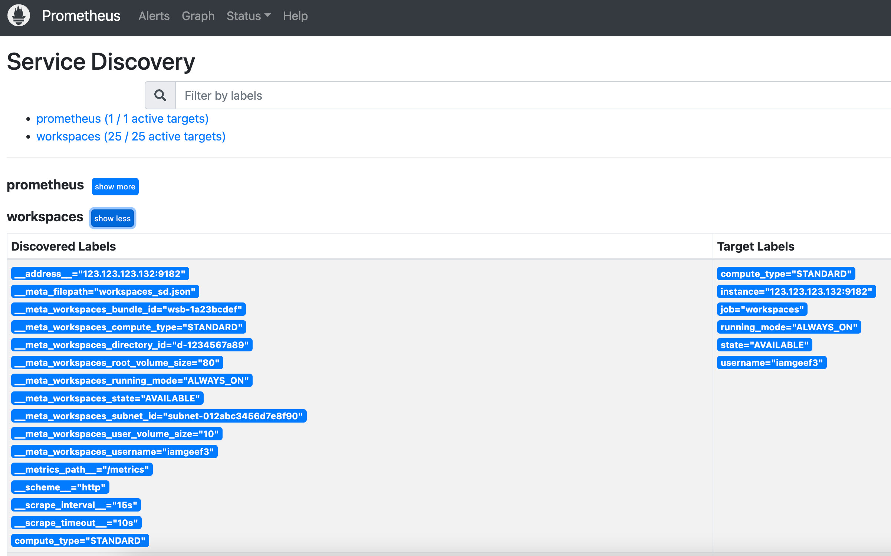

# prometheus-amazon-workspaces-sd

Service discovery for the [Amazon Workspaces](https://aws.amazon.com/workspaces/) platform, compatible with [Prometheus](https://prometheus.io).

## Credits

As well as the other credits listed below, the main hat-tip is to n888 and their [Lightsail Service Discovery](https://github.com/n888/prometheus-lightsail-sd) tool which was used as the basis for this Workspace Service Discovery

## How it works

This service gets the list of Workspaces in a single region from the Workspaces API and generates a file which is compatible with the Prometheus `file_sd` mechanism.

## Pre-requisites

### 1) IAM Policy

When using AWS credentials or IAM Roles, the following policy needs to be attached to the object:

```
{
    "Version": "2012-10-17",
    "Statement": [
        {
            "Effect": "Allow",
            "Action": [
                "workspaces:DescribeWorkspaces"
            ],
            "Resource": [
                "*"
            ]
        }
    ]
}
```

### 2) AWS Credentials

- After attaching the policy above to the target object, authenticate using one of the three options:

#### 2a) AWS Named Profile

To use an AWS named profile, your profile config should be defined under `~/.aws/config` and `~/.aws/credentials`.

The profile name can be specified with either:

- Command line argument `--profile=myProfileName`
- Setting the environment variables `AWS_PROFILE=myProfileName` & `AWS_REGION=us-east-1`

More info: [AWS CLI - Named Profiles](https://docs.aws.amazon.com/cli/latest/userguide/cli-configure-profiles.html)

#### 2b) AWS IAM Key via Environment Variables

Set AWS IAM Key values via environment variables:

- Set the environment variables:
  - `AWS_ACCESS_KEY_ID`
  - `AWS_SECRET_ACCESS_KEY=EXAMPLEKEY`
  - `AWS_REGION=us-east-1`

#### 2c) IAM Role attached to instance

This tool supports AWS IAM Roles attached to instances, ie. running in EC2/ECS/etc.

## Installing it

Download the binary from the [Releases](https://github.com/iamgeef/prometheus-amazon-workspaces-sd/releases) page.

## Running it

```
usage: prometheus-amazon-workspaces-sd [<flags>]

Tool to generate file_sd target files for Amazon Workspaces.

Flags:
  -h, --help               Show context-sensitive help (also try --help-long and --help-man).
      --output.file="workspaces_sd.json"
                           Output file for file_sd compatible file.
      --target.refresh=86400  The refresh interval (in seconds), by default set to 24 hours.
      --profile=""         AWS Profile
      --web.listen-address=":9888"
                           The listen address.
      --web.telemetry-path="/metrics"
                           Path under which to expose metrics.
      --pages=1            Number of results pages to iterate. 1 page = 25 Workspaces
      --exporterPort=9182  Port used by the metrics exporter running on the Workspace.
      --version            Show application version.
```

### Example output:

```
$ ./prometheus-amazon-workspaces-sd --profile=myProfileName
level=debug ts=2022-12-13T23:13:36.168532Z caller=main.go:258 msg="loading shared config"
level=debug ts=2022-12-13T23:13:36.168922Z caller=manager.go:195 msg="Starting provider" provider=workspacesSD subs=[workspacesSD]
level=debug ts=2022-12-13T23:13:36.169054Z caller=main.go:286 msg="listening for connections" addr=:9888
level=debug ts=2022-12-13T23:13:38.537477Z caller=main.go:182 msg="get servers" count=100
level=debug ts=2022-12-13T23:13:38.537505Z caller=main.go:188 msg="server added" source=workspaces/ws-3f9bympsj
level=debug ts=2022-12-13T23:13:38.538038Z caller=main.go:188 msg="server added" source=workspaces/ws-55qvfl28w
level=debug ts=2022-12-13T23:13:38.538055Z caller=main.go:188 msg="server added" source=workspaces/ws-3py27s8f0
...
```

### Prometheus /service-discovery example output



### Systemd service file example

See [examples/systemd/prometheus-amazon-workspaces-sd.service](examples/systemd/prometheus-amazon-workspaces-sd.service)

## Integration with Prometheus

Here is a Prometheus `scrape_config` snippet that configures Prometheus to scrape the discovered workspaces:

```yaml
- job_name: workspaces

  # This config assumes that prometheus and prometheus-amazon-workspaces-sd are started from the same directory:

  file_sd_configs:
    - files: ["./workspaces_sd.json"]

  relabel_configs:
    - source_labels: [__meta_workspaces_running_mode]
      target_label: running_mode
    - source_labels: [__meta_workspaces_username]
      target_label: username
    - source_labels: [__meta_workspaces_state]
      target_label: state
    - source_labels: [__meta_workspaces_compute_type]
      target_label: compute_type
```

The following meta labels are available on targets for relabeling:

- `__meta_workspaces_username="iamgeef"`: username of the workspace assignee
- `__meta_workspaces_subnet_id="subnet-01234567890abcdef"`: subnet id the workspaces is deployed into
- `__meta_workspaces_state="STOPPED"`: current state of the workspace
- `__meta_workspaces_directory_id="d-123456abcd"`: id of the directory the Workspace is connected to
- `__meta_workspaces_bundle_id="wsb-abc12def3"`: id of the bundle use to launch the Workspace
- `__meta_workspaces_compute_type="POWER"` compute type of the Workspace
- `__meta_workspaces_running_mode="AUTO_STOP"` running mode of the Workspace
- `__meta_workspaces_root_volume_gib="80"` size of the root volume in Gib
- `__meta_workspaces_user_volume_gib="10"` size of the user volume in Gib

## Building

`promu` is used for building (https://github.com/prometheus/promu):

Build current arch:

```
promu build
```

Build all archs under `.promu.yml`:

```
promu crossbuild
```

## Contributing

Pull requests, issues and suggestions are appreciated.

## Credits

- Prometheus Authors
  - https://prometheus.io
  - https://prometheus.io/blog/2018/07/05/implementing-custom-sd
  - https://github.com/prometheus/prometheus/tree/master/discovery/ec2
- Scaleway Service Discovery
  - Core code based on https://github.com/scaleway/prometheus-scw-sd
- aws-sdk-go
  - https://aws.amazon.com/sdk-for-go
- Lightsail Service Discovery
  - https://github.com/n888/prometheus-lightsail-sd

## License

Apache License 2.0, see [LICENSE](https://github.com/iamgeef/prometheus-amazon-workspaces-sd/blob/master/LICENSE).
